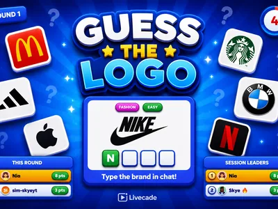
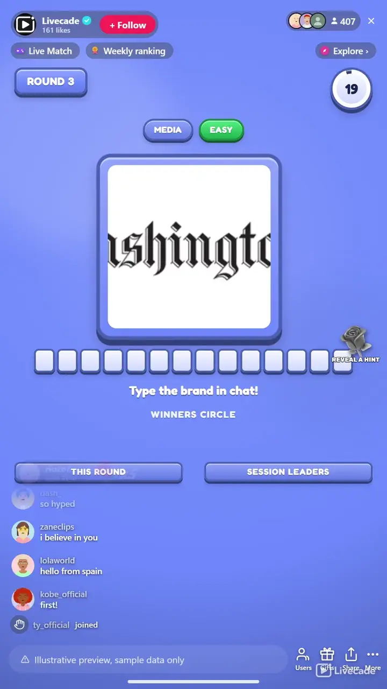

# Guess the Logo - Interactive TikTok Live Game

> Name the brand in chat before the logo comes into focus.

A live brand-guessing race for your whole chat. Each round hides one real brand logo behind a blur, a zoom or a scramble that clears as the clock runs down, and viewers type the brand in chat. Everyone who names it lands in the Winners Circle and scores.

**[Play Guess the Logo on Livecade](https://livecade.io/games/guess-the-logo/?utm_source=github&utm_medium=readme&utm_campaign=guess-the-logo)** - runs as a single browser source in OBS, Streamlabs, or TikTok LIVE Studio. Nothing for viewers to install.

## How viewers play

Viewers take part with the actions TikTok already gives them: **comments**, **gifts**. Every action below is rebindable, so you decide which interaction drives which effect.

| Action | What it does |
| --- | --- |
| **Reveal a hint** | Uncovers one more leading letter of the brand name for everyone and credits the gifter, capped so it never gives the whole name away |

## How it works

### Name the brand in chat

Each round shows one obscured logo and viewers type the brand in chat. Everyone who names it right lands in the Winners Circle and scores, with a bonus for the first correct guess.

### Gifts reveal a hint

A gift uncovers one more leading letter of the brand name to help the room close in and credits the gifter. It is capped so at least one letter always stays hidden, and the win still has to be typed.

### Loops forever on autopilot

The round reveals the answer on a full-screen card with the logo and the round's winners, takes a short break, and rolls into the next brand on its own.

## About the game

Guess the Logo is a hands-off brand quiz for your entire chat. Each round puts one logo on screen, obscured, and slowly brings it into focus while viewers race to type the brand name in chat. Everyone who gets it pops into the Winners Circle and scores, with a bonus for whoever is first.

### Four ways to hide a logo

Zoomed in and pulling back, blurred and coming into focus, or scrambled into tiles that piece themselves together as the round runs. The scramble keeps the logo's real colours and shape on screen while breaking up any wordmark, so the answer has to be recognised rather than read. The effect always stops short of fully clear, so the last seconds never simply hand it over.

### 1,905 brands in thirteen languages

It runs forever through reveal-and-break gaps, tracks a per-round and a session leaderboard, and reads the answer aloud. Filter by category and difficulty, or add and hide logos to build your own bank.

## What it looks like on stream

[Watch Guess the Logo gameplay](https://cdn.livecade.io/games/guess-the-logo.mp4)

## What you can configure

- **Language** - Thirteen languages of accepted brand names, with English always accepted
- **Reveal style** - Zoomed in, blurred, scrambled into tiles, or no effect at all
- **Brand categories and difficulty** - Filter the bank by category and by easy, medium or hard
- **Your logo bank** - Add your own logos, hide the ones you do not want, and edit anything that needs a fix
- **Round mode** - Everyone who names it right scores until the timer, or first correct wins
- **Round time and break** - How long a round runs and the gap before the next logo
- **Points and first-guess bonus** - Points for a correct guess, plus extra for whoever gets it first
- **Limit guesses per viewer** - Optionally cap how many guesses each viewer gets per round
- **Leaderboards** - Show a live round board and a session board, and how many entries
- **Read the answer aloud** - Text-to-speech announcement of the brand and the round winner
- **Background** - Transparent, a solid color, or your own image

## Languages

English, Spanish, Portuguese, French, German, Italian, Indonesian, Arabic, Turkish, Russian, Hindi, Romanian, Filipino

## FAQ

<strong>How do viewers play Guess the Logo?</strong>

Viewers type the brand name in your TikTok Live chat. Everyone who names the logo correctly lands in the Winners Circle and scores, with a bonus for the first.

<strong>Do viewers need to send gifts to play?</strong>

No. Guessing is free and comment-driven. Gifts reveal one more leading letter of the brand name to help the room close in, but it is capped so at least one letter always stays hidden, so gifting helps without buying the win.

<strong>Can I choose which brands come up?</strong>

Yes. Filter by category and by difficulty, and open your logo bank to add your own logos, hide any you do not want, or edit an entry. Changes apply to your streams only.

<strong>Does it need any setup?</strong>

No. It ships with 1,905 brands and loops forever on autopilot, revealing, breaking, and rolling into the next logo on its own, so you can go live and let it run.

<strong>How do I add Guess the Logo to my TikTok Live?</strong>

Add one browser source URL to OBS or your streaming software and go live. There is no plugin to install and nothing for your viewers to download.

<strong>Are the brands affiliated with Livecade?</strong>

No. All trademarks are the property of their owners. Livecade is not affiliated with, endorsed by, or sponsored by any brand shown. Logos appear only as the subject of the guessing game.

## Setup

1. [Create a Livecade account](https://app.livecade.io/register?utm_source=github&utm_medium=cta&utm_campaign=guess-the-logo)
2. Copy your overlay browser source URL
3. Paste it into OBS, Streamlabs, or TikTok LIVE Studio
4. Pick Guess the Logo, set your triggers, and go live

Runs in the browser, so it works on Windows and macOS with nothing to download. [See all TikTok Live games](https://livecade.io/tiktok-live-games/?utm_source=github&utm_medium=readme&utm_campaign=guess-the-logo).

---

_This repository documents Guess the Logo, a hosted interactive game by [Livecade](https://livecade.io/?utm_source=github&utm_medium=footer&utm_campaign=guess-the-logo). The game runs on Livecade's platform, so there is no source to install here._
